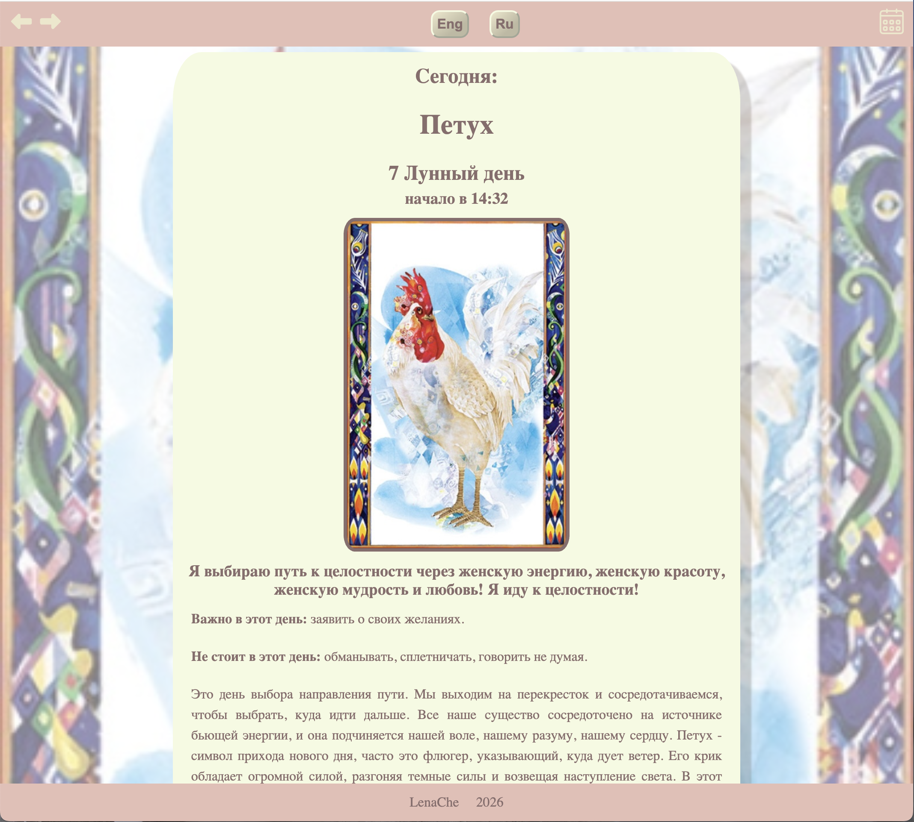

# 🌙 MoonDay

## Description

A web application that displays the current moon phase and provides personalized astrological advice based on the lunar cycle.

## 📖 Table of Contents

- [About the Project](#-about-the-project)
- [Features](#-features)
- [Live Demo](#-live-demo)
- [Tech Stack](#-tech-stack)
- [Getting Started](#-getting-started)
  - [Prerequisites](#prerequisites)
  - [Installation](#installation)
- [Usage](#-usage)
- [API Integration](#-api-integration)
- [Attribution & Credits](#-attribution--credits)
- [License](#-license)
- [Contact](#-contact)

## 🌌 About the Project

MoonDay is a web application designed for anyone curious about the moon's influence on daily life. It calculates the current moon day (lunar day) and pairs it with astrological advice tailored to that specific phase of the lunar cycle.

Whether you're an astrology enthusiast or simply want to align your day with the rhythms of the moon, MoonDay offers a clean, intuitive interface to guide you.

## ✨ Features

🌕 Current Moon Phase Display — See today's moon day at a glance

🔮 Astrological Advice — Personalized guidance based on the lunar cycle

🌍 Weather Integration — Powered by the OpenWeather API for location-aware data

📱 Responsive Design — Works seamlessly on desktop, tablet, and mobile

⚡ Fast & Lightweight — Built with modern web technologies

## 🚀 Live Demo

👉 https://moonday.lenache.org

## 🛠 Tech Stack

Frontend: HTML, CSS, JavaScript, Express.js

API: OpenWeather API

Deployment: Custom domain via lenache.org using Docker.

## 🏁 Getting Started

Follow these steps to set up the project locally.

### Prerequisites

A modern web browser

An OpenWeather API key — Sign up here (https://home.openweathermap.org/users/sign_up)

Git installed.

(Optional) A local development server such as Live Server for VS Code

### Installation

1. Clone the repository

git clone https://github.com/LenaChe2022/Project_Moon.git

cd Project_Moon

2. Set up your API key

Create a config file (e.g., config.js) or add your API key to the environment:

js
const OPENWEATHER_API_KEY = "YOUR_API_KEY_HERE";

⚠️ Never commit your API key to GitHub. Use environment variables or a .env file and add it to .gitignore.

3. Run the app

Install all node packages:

> npm i

Run the app on your machine:

> node index.js

## 💡 Usage

Open the app in your browser.

Allow location access (if prompted) for accurate weather-based data.

View the current moon day displayed on the main screen.

Read the astrological advice tailored to today's lunar phase.

## 🔌 API Integration

This project uses the OpenWeather API to fetch weather data. To comply with OpenWeather's terms:

All weather data is sourced from OpenWeather.

Attribution is provided within the application UI and in this README.

Derivative works are shared under compatible licenses.

For more information, visit the OpenWeather API documentation.

## 🙏 Attribution & Credits

### Weather Data
This application utilizes the OpenWeather API to provide weather data. The API is used under the following licenses:

Creative Commons Attribution-ShareAlike 4.0 International License (CC BY-SA 4.0)

Open Database License (ODbL)

### Attribution Requirements
As required by the license:

✅ All weather data provided by this application is sourced from OpenWeather

✅ Users must give appropriate credit to OpenWeather when using or sharing this data

✅ Any derivative work must be shared under the same or compatible license

### Credit:
Weather data by OpenWeather

## 📄 License
This project is licensed under the Creative Commons Attribution-ShareAlike 4.0 International License (CC BY-SA 4.0) and the Open Database License (ODbL) for the weather data provided by OpenWeather.

Project code: [Add your chosen license, e.g., MIT]

Weather data: (https://creativecommons.org/licenses/by-sa/4.0/) & (https://opendatacommons.org/licenses/odbl/) 

(https://img.shields.io/badge/demo-live-brightgreen)

  (https://opensource.org/licenses/MIT)

## 📬 Contact

Lena Che

GitHub: @LenaChe2022

Project Link: https://github.com/LenaChe2022/Project_Moon

Live Site: https://moonday.lenache.org

 Made with 💫 by <a href="https://github.com/LenaChe2022">Lena Che</a> 
 
 🌙 <em>May the moon guide your day.</em> 🌙 

